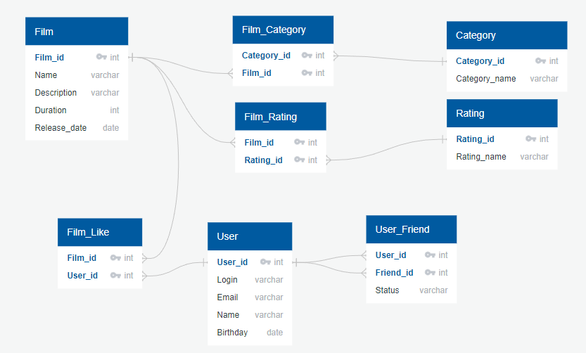

# java-filmorate

## Изображение базы данных



## Основные запросы

### 1. Получить список всех фильмов

```sql
SELECT * FROM film;
```

### 2. Получить список всех фильмов, отсортированных по году выпуска

```sql
SELECT * FROM film ORDER BY year;
```

### 3. Получить список с названием фильмов и категорией

```sql
SELECT f.name, c.category_name FROM
film f JOIN film_category fc ON f.film_id = fc.film_id
JOIN category c ON fc.category_id = c.category_id;
```

### 4. Получить список с названием фильмов и рейтингом

```sql
SELECT f.name, r.rating_name FROM
film f JOIN film_rating fr ON f.film_id = fr.film_id
JOIN rating r ON fr.rating_id = r.rating_id;
```

### 5. Получить список с названием фильмов и именем пользователя, который поставил лайк

```sql
SELECT f.name, u.name FROM
film f JOIN film_like fl ON f.film_id = fl.film_id
JOIN user u ON fl.user_id = u.user_id;
```

### 6. Получить топ-5 фильмов по количеству лайков

```sql
SELECT f.name, COUNT(fl.user_id) FROM
film f JOIN film_like fl ON f.film_id = fl.film_id
GROUP BY f.name
ORDER BY COUNT(fl.user_id) DESC
LIMIT 5;
```

### 7. Получить список всех друзей пользователя с id = 7
```sql
SELECT u.name FROM
user u JOIN user_friend uf ON u.user_id = uf.friend_id
WHERE uf.user_id = 7;
```


